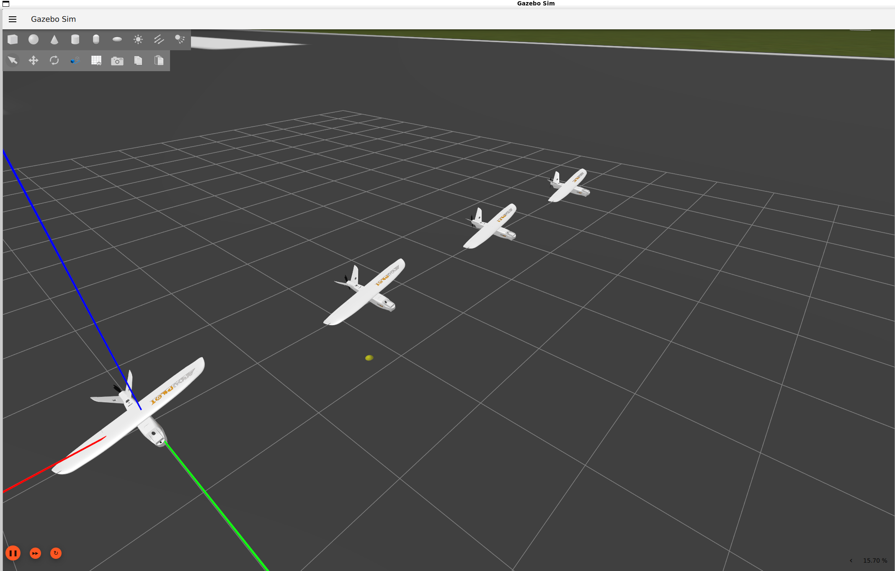
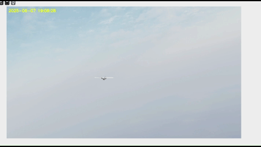

# 🛩️ Savaşan İHA Yarışması – Otonom Yazılım ve Simülasyon Çalışmaları

Bu repo, **Savaşan İHA Yarışması** için geliştirdiğimiz **otonom uçuş yazılımı** ve **simülasyon tabanlı test ortamlarını** özetler.  
Amacımız, gerçek uçuş öncesinde tüm algoritmaları sanal ortamda doğrulamak ve sahaya minimum riskle çıkmaktı.  
* **(Proje kodları geçici süreliğine gizli kalacaktır.)**

---

## 🎯 Yazılım Amacı
- Tamamen **otonom kalkış, uçuş ve iniş** senaryolarını yazılım tabanlı olarak gerçekleştirmek.
- Rakip ve hedef tespitini **görüntü işleme** ile yapıp karar mekanizmasına entegre etmek.
- Tüm algoritmaları gerçek zamanlı sensör verileriyle **ROS 2 + Gazebo** üzerinde test etmek.

---

## 🛠️ Kullanılan Yazılım Araçları ve Teknolojiler
- **ROS 2 Humble** – İHA düğümleri ve sensör simülasyonu.
- **Gazebo Harmonic** – 3D fizik tabanlı uçuş ve sensör ortamı.
- **pymavlink** – Pixhawk uçuş kontrolcüsü ile MAVLink üzerinden komut gönderimi.
- **OpenCV + Pyzbar** – Görüntü işleme ve QR kod tespiti.
- **YOLOv8 (ultralytics)** – Hedef tespiti ve sınıflandırma.
- **Python** – Ana kontrol algoritmaları, görev mantığı, veri işleme.
- **PyQt6** – Yer Kontrol İstasyonu arayüzü (simülasyon telemetrisi ve kontrolü).

---

## 🧩 Simülasyon Senaryoları
1. **Otonom Kalkış ve Seyir**
   - Kalkış komutu ile otomatik rota takibi.
   - Belirlenen irtifa ve hız limitlerinin korunması.
2. **Hedef Tespiti**
   - Kamera verisinden YOLOv8 ile hedef tanıma.
   - QR kod algılama ve konum bilgisini görev motoruna iletme.
3. **Manuel/Otonom Mod Geçişleri**
   - Simülasyon sırasında anlık mod değişikliklerinin test edilmesi.
4. **Otonom İniş**
   - Piste hassas iniş senaryoları ve acil durum inişleri.
5. **Failsafe Durumları**
   - Bağlantı kesilmesi, sensör arızası gibi durumlarda güvenli iniş.

---

## 📊 Geliştirme Süreci
1. **ROS 2 + Gazebo ortamı kurulumu**  
   - Uçak modeli, kamera ve sensörlerin eklenmesi.
2. **MAVLink entegrasyonu**  
   - Simülasyondaki İHA ile komut alışverişinin sağlanması.
3. **Görüntü işleme modülleri**  
   - OpenCV tabanlı veri işleme ve hedef tespiti.
4. **Görev planlama mantığı**  
   - Kalkış, rota takibi, hedef tespiti, iniş.
5. **Yer Kontrol İstasyonu simülasyonu**  
   - Telemetri, harita ve kontrol butonları.

---

## 📷 Örnek Çıktılar
> 
> 
> 

> 
> 
> 
---

## 📄 Not
Bu doküman, yarışma için geliştirilen **yazılım ve simülasyon süreçlerini** özetler.  
Kod ve bazı detaylar güvenlik ve yarışma kuralları sebebiyle paylaşılmamaktadır.

---
